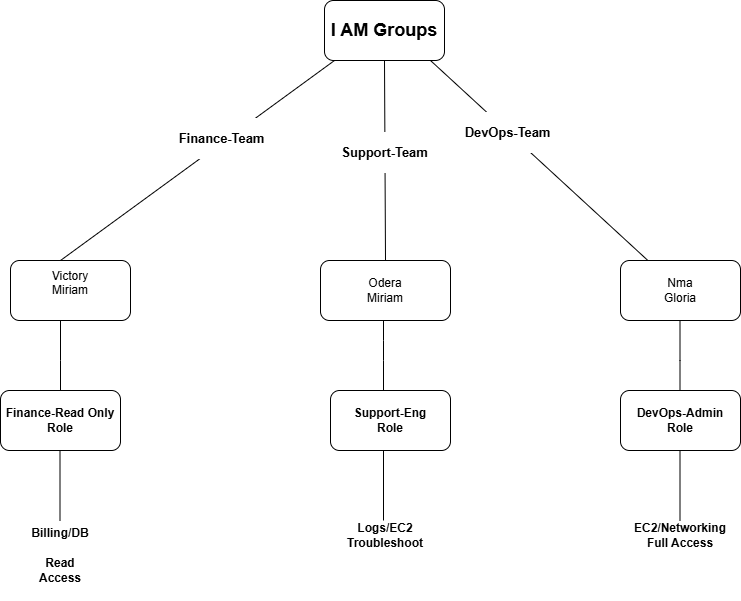

# cloud-onboarding-demo
Demo project showing cloud user onboarding and access management
# Cloud User Onboarding & Access Management Demo

This project simulates onboarding users in a cloud environment using IAM groups and roles.

## Notes on Diagram
- Users inherit permissions from their group’s role/policy
- Finance team: read-only access to billing/database
- Support team: troubleshooting permissions
- DevOps team: full admin access
- ## Diagram of Users → Groups → Roles

*The diagram illustrates how users are organized into groups and assigned roles for secure and efficient access management.*
## Step-by-Step User Onboarding Guide

This guide demonstrates how new users are onboarded into the system and given access based on their role.

### Step 1: Create User Account
- Log in to the cloud platform (AWS/Azure)
- Navigate to Identity & Access Management (IAM)
- Click "Create User"
- Enter user details (Name, Email)
- Select console or programmatic access

### Step 2: Assign User to Group
- Finance users → Finance-Team
- Support users → Support-Team
- DevOps users → DevOps-Team

### Step 3: Assign Permissions
- Finance-Team → Read-only access to billing/database
- Support-Team → Troubleshooting access (logs, limited EC2)
- DevOps-Team → Full administrative access

### Step 4: Verify Access
- Ask user to log in
- Confirm they can access only what they need
- Ensure no unnecessary permissions are granted

### Step 5: Provide Guidance (Support Role)
- Explain system in simple terms
- Walk user through their dashboard
- Answer questions and resolve issues
- Ensure user feels confident using the system

  ## Screenshots (Placeholders)

*(Replace these with actual screenshots from your system)*

-  – User Creation  
-  – Group Assignment  
-  – Role Permissions  

## Optional Video Guide

*(Add a Loom or screen-recorded video link showing onboarding walkthrough)*

[Watch Onboarding Video](https://www.loom.com/share/example)

## Skills Demonstrated

- **Cloud Computing:** AWS, Azure fundamentals  
- **IAM & Access Control:** Users, Groups, Roles, Permissions  
- **Networking & Linux:** Basic setup and troubleshooting  
- **Customer Support:** Onboarding, guidance, live video calls  
- **Tools:** Zoom, Microsoft Teams, Google Meet, Apollo.io, Lemlist  

## Summary

This portfolio project highlights my ability to **combine technical skills with excellent customer support**, guiding users step-by-step while maintaining secure cloud practices.  

It demonstrates real-world capabilities that recruiters and employers value for **technical support, DevOps, and cloud roles**.
